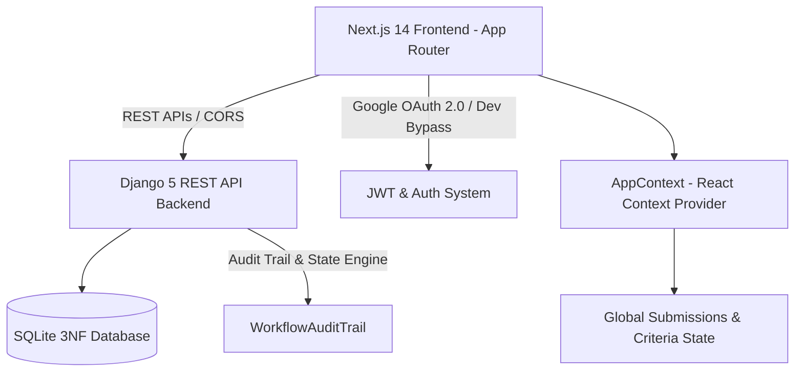
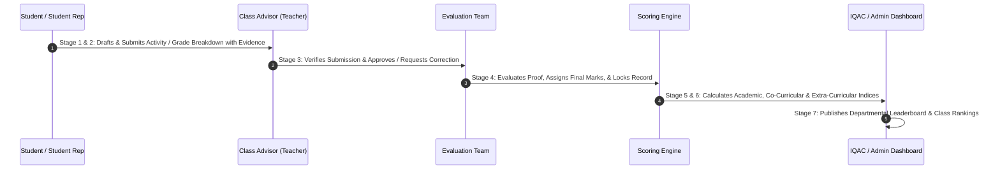

# 📊 Excellence Grid — Marian Best Class Evaluation System
## Comprehensive Technical & Architectural Project Report

---

## 🏛️ Executive Summary

The **Marian Best Class Evaluation System (Excellence Grid)** is a multi-tier institutional web application engineered for **Marian College Kuttikkanam (Autonomous)**. The system systematically evaluates, scores, ranks, and audits departmental classes across three primary pillars:
1. **Academic Excellence** (Grade distribution, pass percentages, S/A+/A counts, pass rates)
2. **Co-Curricular Activities** (NPTEL/MOOC certifications, internships, competitive exam qualifiers, paper publications, research work)
3. **Extra-Curricular Achievements** (Arts/Sports prizes, leadership, social responsibility, campus programs, institutional initiatives)

The project currently exists as a **dual-architecture platform**:
- **Modern Full-Stack Production Architecture**: Next.js 14 App Router + React + TypeScript frontend paired with a Django REST Framework (DRF) 3NF SQLite database backend.
- **Legacy Static Prototype Architecture**: A zero-dependency client-side prototype built using HTML5, Vanilla CSS3, JavaScript (ES6+), and browser `localStorage` state management for rapid offline demonstration and UI validation.

---

## 🏗️ Technical Architecture & Technology Stack



### 1. Frontend Technology Stack
- **Framework**: Next.js 14 (React 18, App Router Architecture)
- **Language**: TypeScript (`tsconfig.json`)
- **Styling**: Modern Vanilla CSS (`app/globals.css`, `legacy-static/style-v2.css`) using CSS Variables, Glassmorphism, smooth animations, dynamic dark theme, and grid-based responsive cards.
- **State Management**: React Context API (`context/AppContext.tsx`) managing synchronized data streams for user sessions, submissions, criteria categories, departments, classes, user groups, and active academic years.
- **Iconography**: `lucide-react` icon package.

### 2. Backend Technology Stack
- **Framework**: Django 5.x / 6.x with Django REST Framework (DRF)
- **Database**: SQLite3 relational schema structured in 3rd Normal Form (3NF)
- **Authentication**: Custom User model extending `AbstractUser`, JWT tokens, Google OAuth integration, and Development Bypass authentication (`auth/bypass/`).
- **Audit Logging**: `WorkflowAuditTrail` model recording state changes, timestamped actor IDs, stage levels (1 to 7), and transition notes.

---

## 🔄 Core 7-Stage Multi-Tier Governance Lifecycle



1. **Stage 1: Student Entry & Proof Upload** — Students/Rep submit achievement details, upload evidence/certificates, or enter grade distributions (S, A+, A grades, total students, pass percentage).
2. **Stage 2: Student Representative (DQC) Verification** — Student Class Representatives / Department Quality Cell (DQC) members verify class-level entries before escalation.
3. **Stage 3: Class Advisor (Teacher) Endorsement** — Class advisors inspect attached documents, verify validity, and either endorse or request corrections.
4. **Stage 4: Evaluator Verification & Locked Marking** — Designated evaluation committee members assign criteria-wise marks based on pre-configured bounds and lock the record.
5. **Stage 5: System Automated Index Calculation Engine** — Dynamic index computation normalizes weighted scores across categories.
6. **Stage 6: HOD & IQAC Oversight** — Head of Department and Internal Quality Assurance Cell review scores, audit logs, and compliance indices.
7. **Stage 7: Leaderboard Ranking & Institutional Publication** — Real-time class rankings and champions tables are rendered.

---

## 📁 Complete Directory & File Structure Analysis

### Root Workspace Files
- [`package.json`](file:///c:/Users/pro/OneDrive/ドキュメント/Marian-Best-Class/package.json): Frontend dependencies (`next`, `react`, `react-dom`, `lucide-react`, `@react-oauth/google`).
- [`tsconfig.json`](file:///c:/Users/pro/OneDrive/ドキュメント/Marian-Best-Class/tsconfig.json): TypeScript configuration for Next.js.
- [`next.config.js`](file:///c:/Users/pro/OneDrive/ドキュメント/Marian-Best-Class/next.config.js): Next.js configuration settings.
- [`README.md`](file:///c:/Users/pro/OneDrive/ドキュメント/Marian-Best-Class/README.md): Primary setup guide and user portal access documentation.
- [`start_backend.bat`](file:///c:/Users/pro/OneDrive/ドキュメント/Marian-Best-Class/start_backend.bat) / [`start_backend.sh`](file:///c:/Users/pro/OneDrive/ドキュメント/Marian-Best-Class/start_backend.sh): Automation scripts to start Django backend.
- [`start_frontend.bat`](file:///c:/Users/pro/OneDrive/ドキュメント/Marian-Best-Class/start_frontend.bat) / [`start_frontend.sh`](file:///c:/Users/pro/OneDrive/ドキュメント/Marian-Best-Class/start_frontend.sh): Automation scripts to launch Next.js dev server.
- [`fix_db.py`](file:///c:/Users/pro/OneDrive/ドキュメント/Marian-Best-Class/fix_db.py): Database utility script for manual SQLite repairs.

---

### 🖥️ Next.js Application Routes (`app/`)

| Route Path | Associated Page File | Description & Functionality |
| :--- | :--- | :--- |
| `/` | [`app/page.tsx`](file:///c:/Users/pro/OneDrive/ドキュメント/Marian-Best-Class/app/page.tsx) | Root landing page embedding [`LandingPage.tsx`](file:///c:/Users/pro/OneDrive/ドキュメント/Marian-Best-Class/components/LandingPage.tsx). |
| `/login` | [`app/login/page.tsx`](file:///c:/Users/pro/OneDrive/ドキュメント/Marian-Best-Class/app/login/page.tsx) | Multi-role authentication page with Google Sign-in & Dev bypass login. |
| `/policy` | [`app/policy/page.tsx`](file:///c:/Users/pro/OneDrive/ドキュメント/Marian-Best-Class/app/policy/page.tsx) | Evaluation Policy Carousel & Rule Reference. |
| `/student/dashboard` | [`app/student/dashboard/page.tsx`](file:///c:/Users/pro/OneDrive/ドキュメント/Marian-Best-Class/app/student/dashboard/page.tsx) | Student workspace dashboard with score cards & submission stats. |
| `/student/submit` | [`app/student/submit/page.tsx`](file:///c:/Users/pro/OneDrive/ドキュメント/Marian-Best-Class/app/student/submit/page.tsx) | Submission creation portal for students with proof upload. |
| `/student/submissions` | [`app/student/submissions/page.tsx`](file:///c:/Users/pro/OneDrive/ドキュメント/Marian-Best-Class/app/student/submissions/page.tsx) | Submissions tracker with filterable status badges. |
| `/student/verification` | [`app/student/verification/page.tsx`](file:///c:/Users/pro/OneDrive/ドキュメント/Marian-Best-Class/app/student/verification/page.tsx) | Student Rep / DQC verification panel. |
| `/student/profile` | [`app/student/profile/page.tsx`](file:///c:/Users/pro/OneDrive/ドキュメント/Marian-Best-Class/app/student/profile/page.tsx) | Student profile page. |
| `/teacher/dashboard` | [`app/teacher/dashboard/page.tsx`](file:///c:/Users/pro/OneDrive/ドキュメント/Marian-Best-Class/app/teacher/dashboard/page.tsx) | Class Advisor dashboard summary and approval queues. |
| `/teacher/verification` | [`app/teacher/verification/page.tsx`](file:///c:/Users/pro/OneDrive/ドキュメント/Marian-Best-Class/app/teacher/verification/page.tsx) | Teacher approval/rejection panel with remark inputs. |
| `/teacher/student-management` | [`app/teacher/student-management/page.tsx`](file:///c:/Users/pro/OneDrive/ドキュメント/Marian-Best-Class/app/teacher/student-management/page.tsx) | Class student roster management. |
| `/evaluator/dashboard` | [`app/evaluator/dashboard/page.tsx`](file:///c:/Users/pro/OneDrive/ドキュメント/Marian-Best-Class/app/evaluator/dashboard/page.tsx) | Evaluator dashboard metrics and evaluation queue. |
| `/evaluator/evaluation` | [`app/evaluator/evaluation/page.tsx`](file:///c:/Users/pro/OneDrive/ドキュメント/Marian-Best-Class/app/evaluator/evaluation/page.tsx) | Evaluator mark assignment & locked evaluation tool. |
| `/admin/academic-years` | [`app/admin/academic-years/page.tsx`](file:///c:/Users/pro/OneDrive/ドキュメント/Marian-Best-Class/app/admin/academic-years/page.tsx) | Academic Year lifecycle manager (Activate/Deactivate years). |
| `/admin/departments` | [`app/admin/departments/page.tsx`](file:///c:/Users/pro/OneDrive/ドキュメント/Marian-Best-Class/app/admin/departments/page.tsx) | Department creation and class assignment. |
| `/admin/criteria` | [`app/admin/criteria/page.tsx`](file:///c:/Users/pro/OneDrive/ドキュメント/Marian-Best-Class/app/admin/criteria/page.tsx) | Criteria catalog editor (Fixed, Count, Range, Negative, Grade breakdown). |
| `/admin/users` | [`app/admin/users/page.tsx`](file:///c:/Users/pro/OneDrive/ドキュメント/Marian-Best-Class/app/admin/users/page.tsx) | User management portal (roles, departments, classes). |
| `/admin/evaluators` | [`app/admin/evaluators/page.tsx`](file:///c:/Users/pro/OneDrive/ドキュメント/Marian-Best-Class/app/admin/evaluators/page.tsx) | Evaluator assignment to specific criteria categories. |
| `/admin/groups` | [`app/admin/groups/page.tsx`](file:///c:/Users/pro/OneDrive/ドキュメント/Marian-Best-Class/app/admin/groups/page.tsx) | Custom User Group management. |
| `/admin/champions` | [`app/admin/champions/page.tsx`](file:///c:/Users/pro/OneDrive/ドキュメント/Marian-Best-Class/app/admin/champions/page.tsx) | Past Champions archive and leaderboard management. |
| `/admin/settings` | [`app/admin/settings/page.tsx`](file:///c:/Users/pro/OneDrive/ドキュメント/Marian-Best-Class/app/admin/settings/page.tsx) | System configuration and global settings. |

---

### 🧩 React Components (`components/`)

- [`LandingPage.tsx`](file:///c:/Users/pro/OneDrive/ドキュメント/Marian-Best-Class/components/LandingPage.tsx): Comprehensive interactive home page with live statistics, champions showcase, criteria overview, and quick login links.
- [`NavSidebar.tsx`](file:///c:/Users/pro/OneDrive/ドキュメント/Marian-Best-Class/components/NavSidebar.tsx): Role-aware sidebar navigation component.
- [`EvaluationGrid.tsx`](file:///c:/Users/pro/OneDrive/ドキュメント/Marian-Best-Class/components/EvaluationGrid.tsx): Visual grid displaying criteria categories and sub-items.
- [`PolicyCarousel.tsx`](file:///c:/Users/pro/OneDrive/ドキュメント/Marian-Best-Class/components/PolicyCarousel.tsx): Interactive evaluation policy slide deck with guidelines.
- [`ScoreCalculation.tsx`](file:///c:/Users/pro/OneDrive/ドキュメント/Marian-Best-Class/components/ScoreCalculation.tsx): Real-time index calculator component displaying weighted scores.
- [`WorkflowTimeline.tsx`](file:///c:/Users/pro/OneDrive/ドキュメント/Marian-Best-Class/components/WorkflowTimeline.tsx): Audit trail visualizer showing submission progress through the 7 stages.
- [`OutcomesGrid.tsx`](file:///c:/Users/pro/OneDrive/ドキュメント/Marian-Best-Class/components/OutcomesGrid.tsx): Visual representation of institutional outcomes.
- [`Footer.tsx`](file:///c:/Users/pro/OneDrive/ドキュメント/Marian-Best-Class/components/Footer.tsx): Footer with Marian College credits.

#### Role Workspaces (`components/roles/`)
- [`StudentWorkspace.tsx`](file:///c:/Users/pro/OneDrive/ドキュメント/Marian-Best-Class/components/roles/StudentWorkspace.tsx): Full-featured student portal component (submission creation, proof management, grade breakdown form).
- [`TeacherWorkspace.tsx`](file:///c:/Users/pro/OneDrive/ドキュメント/Marian-Best-Class/components/roles/TeacherWorkspace.tsx): Class Advisor verification workspace component.
- [`EvaluatorWorkspace.tsx`](file:///c:/Users/pro/OneDrive/ドキュメント/Marian-Best-Class/components/roles/EvaluatorWorkspace.tsx): Evaluator scoring workspace component.
- [`AdminWorkspace.tsx`](file:///c:/Users/pro/OneDrive/ドキュメント/Marian-Best-Class/components/roles/AdminWorkspace.tsx): Complete system administration workspace component.
- [`BestClassDashboard.tsx`](file:///c:/Users/pro/OneDrive/ドキュメント/Marian-Best-Class/components/roles/BestClassDashboard.tsx): Leaderboard ranking component.

---

### 🐍 Backend Data Models (`backend/users/models.py`)

1. `AcademicYear`: Tracks academic sessions (`2025-2026`), active status flag.
2. `Department`: Departments (`MCA`, `BCA`, `IQAC`, `ADMIN`).
3. `Class`: Departmental classes (`BCA A`, `MCA 2025`), linked to `class_teacher` and `dqc_member`.
4. `User`: Custom user extending `AbstractUser` with fields `google_id`, `email`, `role`, `department`, `class_name`.
5. `Submission`: Central entity tracking student/class submissions, multi-stage statuses (`Draft`, `Submitted`, `Pending Rep Verification`, `Student Rep Verified`, `Teacher Verified`, `Evaluated`, `Locked`, etc.), attached proofs, evidence JSON, and stage-wise remarks.
6. `CriteriaCategory`: Category definitions (`cat-academics`, `cat-cocurricular`, etc.) with evaluator bindings.
7. `CriteriaItem`: Evaluation items under categories with rule types (`count`, `fixed`, `range`, `negative`, `academic_grades`) and JSON rules.
8. `AcademicGradeBreakdown`: Academic grade data per class (S, A+, A counts, Fail count, class pass percentage, total students).
9. `WorkflowAuditTrail`: Complete audit logging for every status change, recording actor ID, stage number, previous status, new status, and remarks.
10. `ClassIndexResult`: Final compiled weighted scores (Academic, Co-curricular, Extra-curricular) and computed rank.
11. `UserGroupModel`: Custom user groups for bulk permissions.
12. `Champion`: Historic champion class records and leaderboard items.

---

### 🌐 Backend REST API Endpoints (`backend/users/urls.py`)

| Endpoint URL | HTTP Method(s) | Function / Description |
| :--- | :--- | :--- |
| `/api/auth/google/` | `POST` | Authenticate using Google OAuth token. |
| `/api/auth/bypass/` | `POST` | Developer bypass login for instant role testing. |
| `/api/auth/profile/` | `GET`, `PUT` | Retrieve or update active user profile. |
| `/api/auth/classes/` | `GET` | List all available classes. |
| `/api/academic-years/` | `GET`, `POST` | Manage academic years. |
| `/api/departments/` | `GET`, `POST` | Manage departments. |
| `/api/users/` | `GET`, `POST`, `PUT` | Manage user accounts and role assignments. |
| `/api/submissions/` | `GET`, `POST` | Fetch filtered submissions or create new submission. |
| `/api/submissions/<id>/` | `GET`, `PUT`, `DELETE` | Retrieve, update status/remarks, or delete submission. |
| `/api/criteria-categories/`| `GET`, `POST` | Manage criteria categories. |
| `/api/criteria-items/` | `GET`, `POST` | Manage criteria items and scoring rules. |
| `/api/user-groups/` | `GET`, `POST` | Manage custom user groups. |
| `/api/champions/` | `GET`, `POST` | Manage champion leaderboard records. |
| `/api/settings/` | `GET`, `POST` | Retrieve or update system settings. |

---

## ⚡ Quick Start & Deployment Guide

### 1. Prerequisites
- **Node.js**: `v18.x` or `v20.x`
- **Python**: `v3.10.x` or `v3.12.x`
- **Git** & standard terminal (PowerShell or Bash)

### 2. Backend Initialization (Django REST Framework)
```bash
# Navigate to backend directory
cd backend

# Create & activate Python virtual environment
python -m venv venv
# On Windows:
.\venv\Scripts\activate
# On Linux/macOS:
source venv/bin/activate

# Install dependencies
pip install -r requirements.txt

# Run migrations & seed database
python manage.py makemigrations users
python manage.py migrate
python manage.py seed_users

# Create Django Superuser (Optional for Django Admin access)
python manage.py createsuperuser --email admin@mariancollege.org --username admin

# Start Backend Server
python manage.py runserver 8000
```

### 3. Frontend Initialization (Next.js 14)
```bash
# Open new terminal in root directory
npm install

# Start Next.js development server
npm run dev
```

The application frontend will be live at `http://localhost:3000` and backend API at `http://127.0.0.1:8000`.

---

## 👥 Role Permissions & Portal Matrix

| User Role | Portal Access Route | Key Capabilities & Operations |
| :--- | :--- | :--- |
| **Student** | `/student/dashboard` | Create activity entries, upload proof/links, track submission status. |
| **Student Rep (DQC)**| `/student/verification` | Verify class submissions, enter class grade distributions (S, A+, A, Pass %). |
| **Class Advisor** | `/teacher/dashboard` | Endorse verified submissions, request student corrections, add advisor notes. |
| **Evaluator** | `/evaluator/dashboard` | Assess evidence, assign final score within criteria limits, lock record. |
| **Admin** | `/admin/academic-years` | Manage departments, classes, users, criteria catalog, academic year activation. |
| **IQAC / HOD** | `/dashboard/iqac` | View institutional index summaries, compliance reports, and rankings. |

---

## 📝 Summary & Key Strengths

1. **Dual-Architecture Strategy**: Offers both an offline-ready static prototype for zero-install demonstrations and a robust Next.js + Django full-stack platform for enterprise deployment.
2. **Auditability & Integrity**: `WorkflowAuditTrail` guarantees complete auditability across all 7 evaluation stages, preventing unauthorized score modifications.
3. **Flexible Dynamic Criteria System**: Supports fixed marks, count-based metrics, range-based score scales, negative marks, and academic grade percentage calculations.
4. **Role Isolation**: Strict permission isolation between Students, Student Representatives, Class Advisors, Evaluators, and System Administrators.
